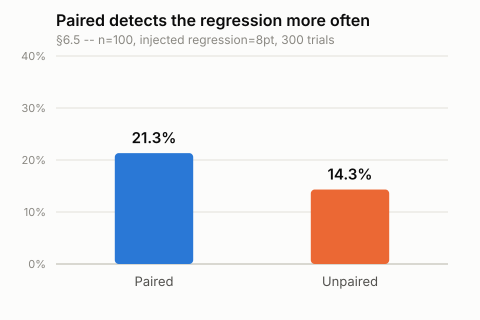

# LLM Regression Suite

Someone edits a system prompt, or swaps a model, and something about the output quietly gets worse — a refusal that used to work now doesn't, a tone shift nobody asked for, an edge case that silently stopped resolving. Nothing crashes. No test fails. Three weeks later a support ticket traces it back to that PR. This tool exists to catch that in CI, before it ships.

It runs the baseline and candidate against the same paired dataset, computes a bootstrap confidence interval on the per-case difference (not two averages compared — see [why pairing matters](docs/STATISTICS.md#1-paired-comparison-not-two-independent-runs)), scores subjective quality with an LLM judge that has to earn trust against real human labels before it's allowed to block anything, and reports a verdict a skeptical engineer can act on: `regression`, `no_detectable_difference`, `improvement_detected`, or `insufficient_data` — never a bare "changed."

## The null model result

Before trusting any of this, it has to measure its own false alarm rate. Run two variants with **identical** true behavior against each other, repeatedly, on data where nothing actually changed, and count how often the tool claims something did.

```
$ llmreg simulate null
Null model: 2000 trials, alpha=0.05
  regression rate (one-sided, blocks a PR):     2.35%  target ~2.50% (alpha/2)  within tolerance
  improvement rate (one-sided, symmetric tail): 2.65%
  combined rate (CI excluded zero at all):      5.00%  target ~5.00% (alpha)   within tolerance
```

Read this precisely, because the two numbers answer different questions and it would be easy to round them into one misleading claim:

- **The rate that actually blocks a PR** (`verdict: regression`, the only verdict that fails the check) is **2.35%** at `α = 0.05` — a `regression` verdict requires the *entire* confidence interval to sit on the harmful side, which is a one-sided read of a two-sided interval, and under a true null that lands at `α/2` by construction, not `α`.
- **The rate the interval moves away from zero at all**, in either direction (`regression` or `improvement_detected` combined), is **5.00%** — matching `α` exactly, exactly as standard two-sided confidence-interval theory predicts.

Both numbers are correct; they're just not the same claim. If you're asking "how often does this tool cry wolf on a PR," the answer is the smaller one. Full derivation, the two independent ways it was checked, and the reasoning for reporting both instead of picking one: [`docs/DECISIONS.md`](docs/DECISIONS.md#phase-6), [`docs/STATISTICS.md §8.2`](docs/STATISTICS.md).

## Power curve

The single most useful number this tool can give you isn't "significant" or "not significant" — it's how big a regression your dataset is even capable of seeing. A 40-case suite that reports "no detectable difference" on a real 8-point regression didn't tell you the change is safe; it told you the suite is blind under 20 points.

```
$ llmreg simulate power
Power curve (detection rate by effect size x sample size):

n\effect   1pt   2pt   5pt  10pt  20pt
n=20        3%    3%    7%    9%   29%
n=50        5%    5%   11%   19%   53%
n=100       5%    5%   13%   27%   85%
n=250       1%    6%   25%   62%  100%
n=500       7%    8%   44%   89%  100%
```

Reported minimum detectable effect (MDE) at ~80% power was checked against where this grid actually crosses 80% and agreed within a few points at every sample size tried (§8.4 of the statistics doc). And pairing isn't complexity for its own sake: on the same synthetic 8-point regression at n=100, the paired analysis this tool actually uses detected it 21.3% of the time; discarding the pairing and comparing two averages instead — the naive approach — detected it only 14.3% of the time, at the identical sample size.



## How the statistics work, briefly

- **Paired bootstrap confidence interval** on the per-case difference, not a comparison of two averages — cancels out case-to-case difficulty variance that would otherwise swamp a real effect.
- **McNemar's test** computed alongside every comparison as a discordant-pairs cross-check, never overriding the bootstrap verdict.
- **Cohen's kappa** validates any LLM judge against real human labels before its scores can drive a verdict — raw agreement alone is misleading (a judge that says "pass" unconditionally on a 90%-pass dataset looks 90% "accurate" and has learned nothing; kappa corrects for exactly that).
- Every verdict is deliberately asymmetric: this tool detects harm, or reports it cannot detect a difference. It never certifies a change as "good" — see [`docs/STATISTICS.md`](docs/STATISTICS.md) for why.

We are not statisticians by training. Every method above is standard, textbook material, implemented in-repo rather than pulled from a library so it can be read and verified line by line — see [`docs/STATISTICS.md`](docs/STATISTICS.md) for the full plain-language explanation of each one, and [`docs/DECISIONS.md`](docs/DECISIONS.md) for every real alternative that was considered and why it lost.

## What this is not

This is not an eval platform, a prompt-testing dashboard, or an LLM observability product — [promptfoo](https://promptfoo.dev), [LangSmith](https://www.langchain.com/langsmith), and [Braintrust](https://www.braintrust.dev) already do those well, and this tool assumes you might already use one of them for iteration. This is narrowly a **paired regression-detection check for CI**: given a baseline and a candidate, did anything measurably get worse, with a stated confidence interval and a stated false-alarm rate — not a place to browse traces, build prompts interactively, or manage a broader eval workflow.

## Quickstart

```bash
git clone https://github.com/NovaVey/LLM-Regression-Suite.git
cd LLM-Regression-Suite
npm install
npm run build

# No API key or database needed for this one -- pure synthetic validation:
node packages/cli/dist/index.js simulate null

# These need DATABASE_URL / ANTHROPIC_API_KEY in .env (see .env.example):
node packages/cli/dist/index.js doctor
node packages/cli/dist/index.js run --suite examples/support-agent/suite.json --dataset examples/support-agent/dataset.json --label baseline
node packages/cli/dist/index.js compare --suite examples/support-agent/suite.json --baseline-run <id> --candidate-run <id>
```

## Status

Phases 0–6 of the build are complete and tested (158 tests, `npx vitest run`): statistics core, dataset/suite config, the runner with caching and deterministic graders, the paired comparison engine, LLM-judge grading with kappa-gated calibration, and the statistical validation above. Still to come: the report/PR-comment layer, the GitHub Action, a report UI, and the full 240-case example suite with a real demo — see [`PROGRESS.md`](PROGRESS.md) for exactly what's built and what's next.

## License

MIT — see [`LICENSE`](LICENSE).
